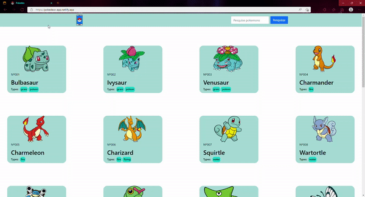

<h1>Pokedex</h1>

<h2>Projeto desenvolvido consumindo a api <a href="https://pokeapi.co/">Pokemons</a></h2>

<h2>Tecnologias utilizadas</h2>
<ol>
    <li>ReactJS</li>
    <li>Bootstrap</li>
</ol>

<h2>Versão web:</h2>

<h2>Versão mobile:</h2>

